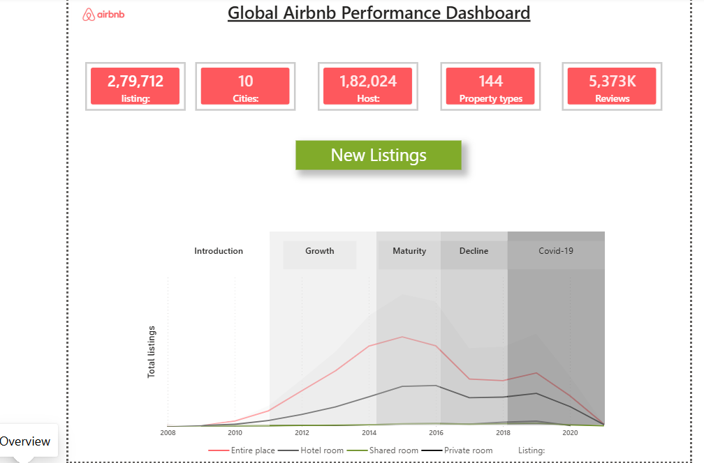
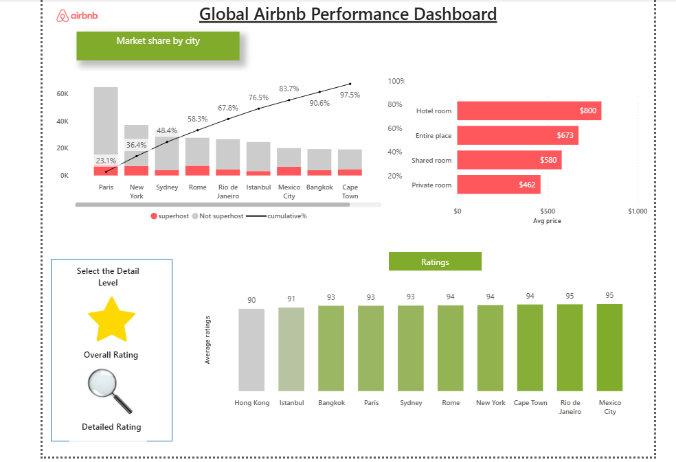

# Airbnb-global-performance-dashboard

## Project Overview
Developed an interactive Power BI dashboard to analyze Airbnb listing performance across multiple global cities. The dashboard provides insights into listings, hosts, reviews, pricing, market share, and customer ratings.

## Tools Used
- Power BI Desktop
- Power Query
- DAX
- Data Modeling

## Business Problem
Airbnb operates across multiple cities and property types. The objective was to analyze:
- Listing growth trends
- Market share by city
- Average pricing by room type
- Customer ratings across cities
- Impact of different property categories

## Dashboard Features

### Overview Page
- Total Listings
- Total Cities
- Total Hosts
- Property Types
- Reviews
- Listing Growth Trend Analysis
- Room Type Comparison

### Market Share & Ratings Page
- Market Share by City
- Superhost vs Non-Superhost Analysis
- Average Price by Room Type
- Overall Ratings Analysis
- Detailed City-wise Rating Comparison

## Key Insights
- Entire Place listings dominate the Airbnb platform.
- Hotel Rooms have the highest average price.
- Mexico City and Rio de Janeiro received the highest customer ratings.
- Paris contributes the largest market share among analyzed cities.
- Listings experienced strong growth before the COVID-19 period.

## Skills Demonstrated
- Data Cleaning
- Data Modeling
- DAX Calculations
- Dashboard Design
- KPI Development
- Business Insights Generation

## Dashboard Preview

### Overview Page

### Review Page

## Author
Shruti Bhanushali
